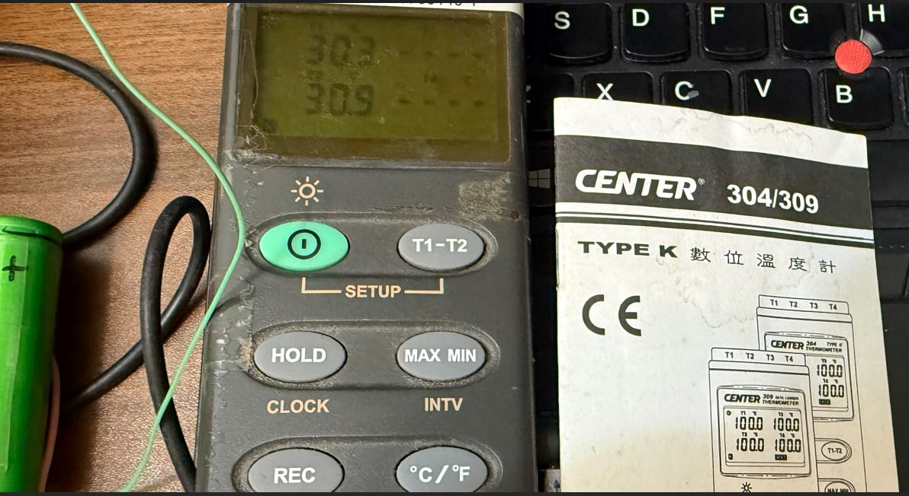

# center309_web_ble_interface
Web BLE connected, no physical cable to PC, github hosted index.html, iphone/pc/android phone direct loading up, no need installation

### the meter used
SE-309 or Center309/304 or HH309 those are same OEM item  
  

### uses browser with web API enabled, Edge, Chrome, not Firefox  
load from the server, link following  
https://xiaolaba.github.io/center309_web_ble_interface/
se309_ble_thermometer_dashboard_webserver_hosted.JPG  
  

### download to your local drive  
save to your computer  
load from your local drive, it is ok  
se309_ble_thermometer_dashboard.JPG  
  

### how to

[se309_iphone.md](se309_iphone.md)  

### related projects
https://github.com/xiaolaba/center309_rs232_interface  
https://github.com/xiaolaba/HH309_logger_reader  
https://github.com/xiaolaba/artisan_kaleido_artisan-2.4.6  
https://github.com/xiaolaba/artisan  
